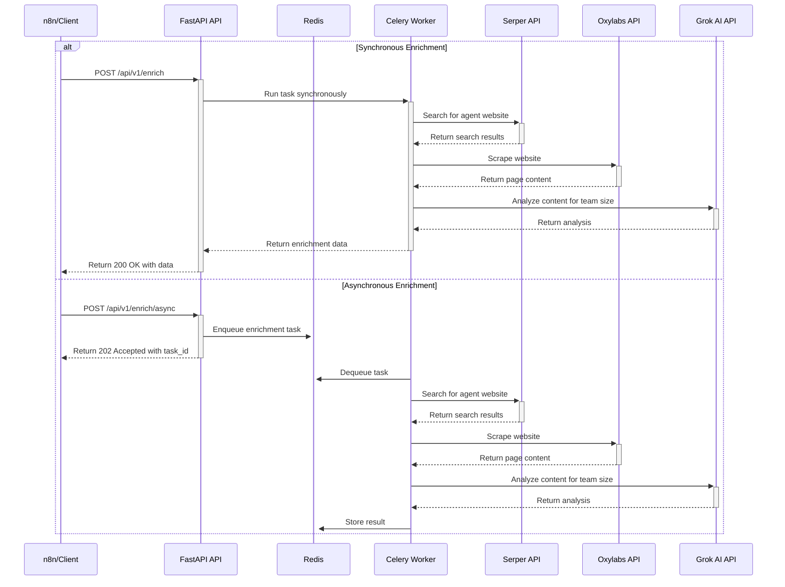
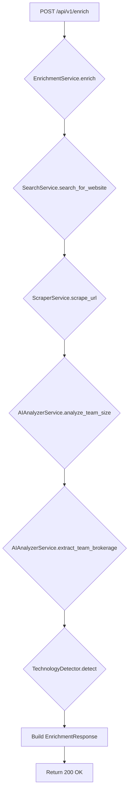
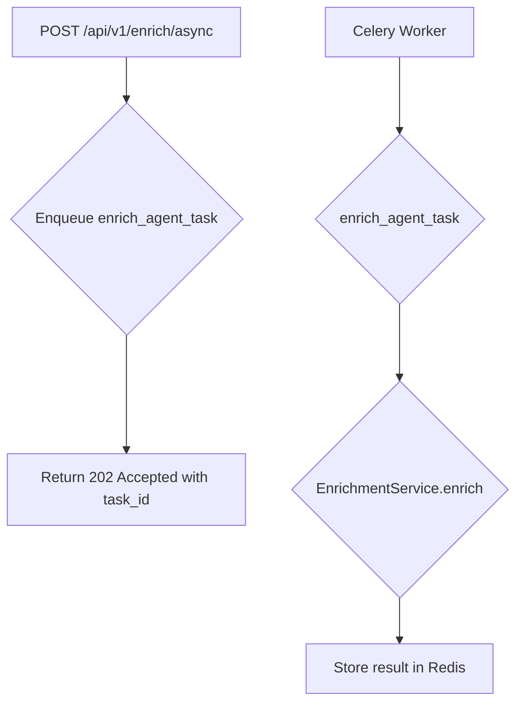

# Architecture & Design

This document provides a comprehensive overview of the Team Size Webhook API's architecture, design, and implementation details. It is intended for developers, architects, and product managers who want to understand how the system works.

## 1. System Overview

The Team Size Webhook API is a high-throughput service that enriches real estate agent data with team size information. It uses a combination of web scraping, AI-powered analysis, and external data sources to provide accurate and detailed enrichment results.

### Key Features

- **Synchronous & Asynchronous Processing**: Offers both immediate (sync) and high-throughput (async) enrichment options.
- **Scalable Architecture**: Designed to handle thousands of requests per minute by scaling Celery workers.
- **AI-Powered Analysis**: Leverages the Grok AI model for intelligent team size estimation and data extraction.
- **Comprehensive Enrichment**: Provides not only team size but also team members, brokerage information, and detected technologies (CRMs).
- **Robust Error Handling & Retries**: Includes mechanisms for handling external API failures and retrying requests.

## 2. Architecture

The system follows a microservices-oriented architecture, with a clear separation of concerns between the API, background worker, and external clients.

### System Components

- **FastAPI Application**: The main entry point for the API, responsible for handling incoming requests, validation, and routing.
- **Celery Worker**: A distributed task queue for processing asynchronous enrichment requests.
- **Redis**: Used as a message broker for Celery and for rate limiting.
- **External Services**: Integrates with Serper (for Google search), Oxylabs (for web scraping), and Grok (for AI analysis).

### Architecture Diagram

## 3. Code Structure

The codebase is organized into a `src` directory, which contains the main application logic. The structure is as follows:

- `src/api/`: Contains the FastAPI application, including endpoints, middleware, and dependencies.
- `src/clients/`: Encapsulates the logic for interacting with external APIs (Grok, Oxylabs, Serper).
- `src/config/`: Manages application settings and configuration using Pydantic.
- `src/core/`: Includes core components like logging, exceptions, and Redis client.
- `src/prompts/`: Defines the prompts used for AI analysis.
- `src/schemas/`: Contains Pydantic models for request/response validation and internal data structures.
- `src/services/`: Implements the core business logic, such as enrichment orchestration, AI analysis, and web scraping.
- `src/worker/`: Defines the Celery application and background tasks.

## 4. Data Flow & Workflows

### Synchronous Enrichment Workflow

### Asynchronous Enrichment Workflow

## 5. Actionable Insights & Recommendations

### For the Software Architect

- **Consider a more robust database**: While Redis is suitable for caching and message brokering, a relational database like PostgreSQL could be beneficial for storing and querying enrichment results, especially for historical analysis.
- **Implement a dead-letter queue**: For failed Celery tasks, a dead-letter queue would allow for easier debugging and reprocessing of failed jobs.
- **Enhance security**: The current CORS policy allows all origins (`"*"`). For production, it should be restricted to specific domains.

### For the Software Developer

- **Refactor `team_size_estimator.py`**: The logic in `team_size_estimator.py` should be fully migrated to the new service-oriented architecture in the `src` directory to avoid code duplication and confusion.
- **Improve test coverage**: While the `README.md` mentions 117 tests, adding more tests for the individual services and clients would improve code quality and reduce the risk of regressions.
- **Add more detailed logging**: While the logging is good, adding more context to log messages (e.g., which external API is being called) would make debugging easier.

### For the Product Manager

- **Expand technology detection**: The current technology detection is limited to a few CRMs. Expanding this to include other real estate technologies (e.g., IDX providers, marketing automation tools) would add significant value.
- **Introduce a confidence score for brokerage information**: Similar to the team size analysis, providing a confidence score for the extracted team and brokerage names would help users gauge the accuracy of the data.
- **Offer a webhook for async task completion**: Instead of requiring users to poll the `/tasks/{task_id}` endpoint, a webhook that notifies them when a task is complete would improve the user experience.

This document provides a solid foundation for understanding the Team Size Webhook API. By implementing the recommendations above, the system can be further improved in terms of scalability, maintainability, and functionality.
